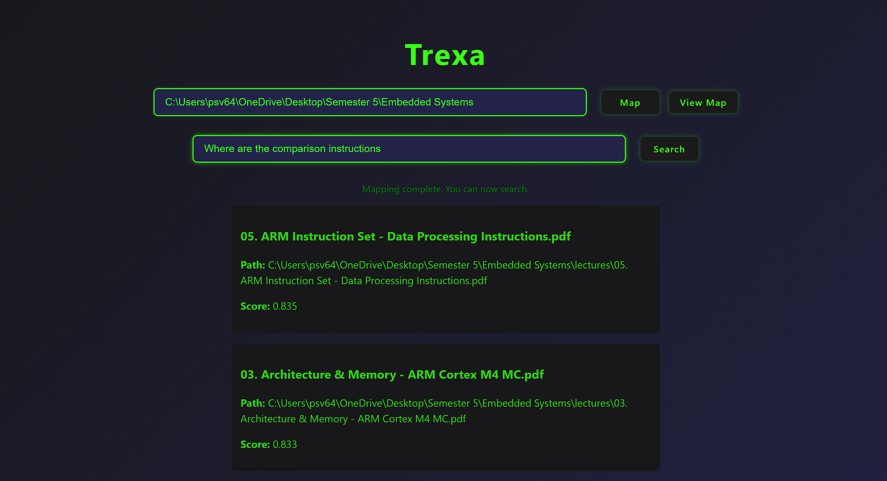
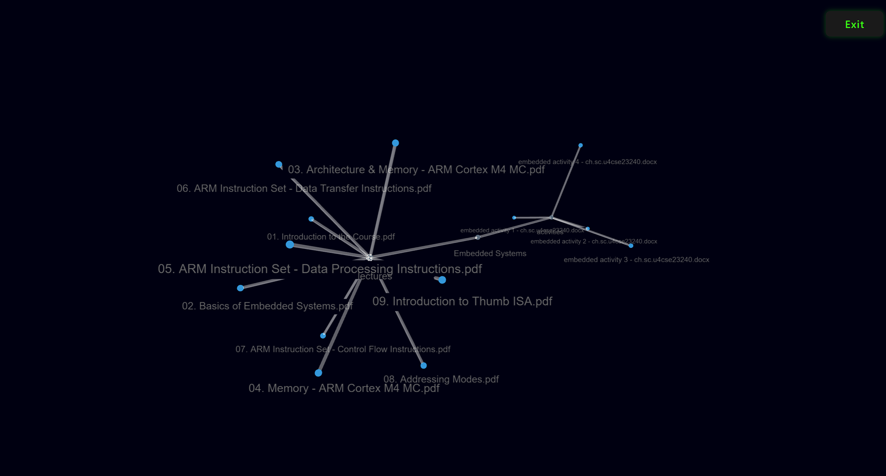

# << Trexa >>

**Trexa** is a full-stack, AI-powered semantic file search and visualization tool. It enables users to **intelligently search through their local directories** and **interactively explore their file structure** in 3D.

---

## Features

### -> Directory Indexing
- Automatically walks through and indexes all files in a given folder.
- Parses file content and generates semantic embeddings using e5-small-v2 model.
- Stores vector embeddings in **ChromaDB** for fast retrieval.

### -> Semantic Search
- Search using natural language queries like _"lecture notes on reinforcement learning"_.
- Returns top most relevant files ranked by semantic similarity — not just keyword matches.
- Displays metadata such as file name, full path, and relevance score.

### -> 3D Visualization
- Visualize the entire file/folder structure in a **3D interactive force-directed graph**.
- Pan, zoom, and rotate freely. Node names remain visible.
- Easily grasp complex directory layouts at a glance.

### -> Modern UI/UX
- Built with **React + TypeScript** and styled using **CSS modules**.
- Dark, neon-themed design with responsive layout.
- Clean user flow with hover effects, loading indicators, and status messages.

---

## Tech Stack

| Layer       | Technologies                                      |
|-------------|---------------------------------------------------|
| Frontend    | React (TypeScript), 3d-force-graph, Three.js      |
| Backend     | FastAPI (Python), ChromaDB                        |
| Embeddings  | E5-small model (with GPU acceleration)            |
| APIs        | RESTful endpoints (`/index`, `/search`, `/graph`) |
| Deployment  | Docker-ready, easy to host locally or on cloud    |

---

## Workflow

1. **Map a Directory**  
   -> Input a folder path → Backend indexes files & stores vector embeddings.

2. **Semantic Search**  
   -> Input a natural query → Trexa finds top-matching files from your system.

3. **3D Map View**  
   -> Click “Visualize” → Explore your folder structure as a dynamic 3D graph.

---

## Use Cases

- Instantly locate relevant files without remembering exact names.
- Understand file organization in large codebases or research directories.
- Boost productivity for developers, researchers, writers, or analysts.

---

## Screenshots

### -> Main Interface


### -> 3D File Visualization


---

## 🧪 Running Locally

```bash
# Clone the repo
git clone https://github.com/Sandeep-Vigneshwar/Trexa.git
cd Trexa

# Start backend (FastAPI)
cd backend
pip install -r requirements.txt
uvicorn main.app:app --port:8080 --reload

# Start frontend
cd ../frontend
npm install
npm run dev
```
